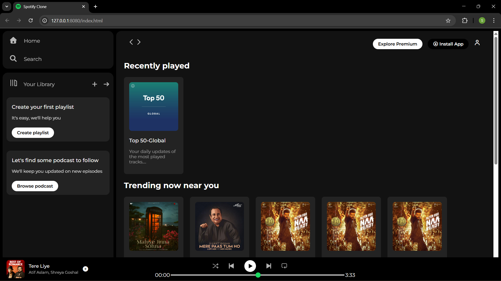

# Spotify Clone — HTML / CSS Project

    This is a front-end clone of Spotify’s UI built using pure HTML and CSS.
    No frameworks, no JS functionality — strictly interface replication.
    The goal is to practice layout, positioning, responsive UI, and component structure.

---

**✅ Features Implemented**

- Sidebar with navigation (Home, Search, Library)

- Playlist and podcast placeholder sections

- Sticky top navigation bar

- Card-based sections:

  - Recently Played

  - Trending

  - Featured Charts

- Fully fixed bottom music player footer

  - Song thumbnail + title + artist

  - Playback controls (UI only)

  - Progress bar slider (non-functional)

---

**🛠️ Tech Stack**

- HTML5

- CSS3 (Flexbox)

- Google Fonts — Montserrat

- Font Awesome icons

- No JavaScript yet.

---

**📂 Project Structure**

```
/
├── index.html
├── styles.css
├── assets/
│ ├── logo.png
│ ├── album-img.jpeg
│ ├── player_icon1.png
│ ├── player_icon2.png
│ ├── ...etc
└── README.md
```

---


**What This Project Does NOT Include (Yet)**

- No real music playback

- No authentication

- No API integration

- No dynamic playlists

- It’s strictly UI.

---

**🔥 Planned Improvements**

- Add these when you’re not being lazy:

- Responsive layout for tablets & mobile

- Replace placeholder icons with SVGs

- JS for:

  - play/pause logic

  - updating progress bar

  - switching tracks

  - Dark/light theme toggle

  - Real data using Spotify Web API

---

**📸 Screenshot**
